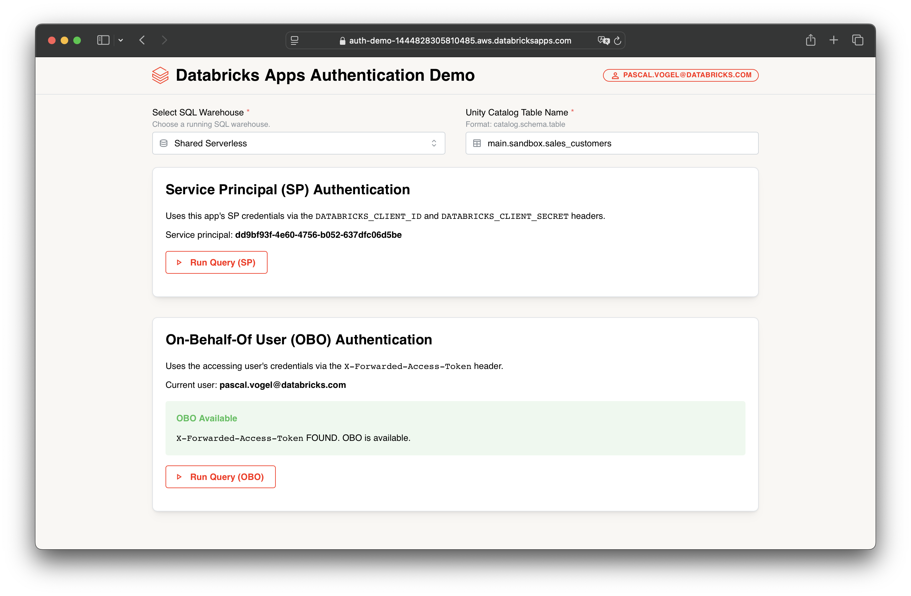

# Databricks Apps: Service Principal and OBO Authentication Demo

This code sample demonstrates how to use different authentication methods within a [Databricks App](https://docs.databricks.com/en/dev-tools/databricks-apps/index.html) to query data from a Databricks SQL Warehouse via Unity Catalog.

It showcases two authentication patterns:

1.  **Service Principal (SP) Authentication:** Uses the app's own configured Service Principal credentials (via `DATABRICKS_CLIENT_ID` and `DATABRICKS_CLIENT_SECRET`) to connect and run queries.
2.  **On-Behalf-Of (OBO) Authentication:** Uses the accessing user's identity by leveraging the `X-Forwarded-Access-Token` header provided by Databricks when OBO is enabled for the app.



## Deploying as a Databricks App

1. Load this GitHub repository as a [Databricks Git folder](https://docs.databricks.com/en/repos/index.html) in your Databricks workspace.
1. In your Databricks workspace, switch to **Compute** -> **Apps**.
1. Choose **Create app**.
1. Under **Choose how to start**, select **Custom** and choose **Next**.
1. Input a name for your app.
1. Under **Advanced settings**, make sure to enable the SQL auth scope by ticking the box next to **Allow the app to execute SQL and manage SQL related resources in Databricks**.
1. Choose **Create app**.
1. Once your app compute has started, choose **Deploy**.
1. Navigate to your new Git folder and select the `auth-demo` folder.
1. Choose **Deploy**.

## Running Locally

1. Clone this repo to your local machine and switch into the `auth-demo` folder:
   ```bash
   git clone https://github.com/databricks-solutions/databricks-apps-examples.git
   cd databricks-apps-examples/auth-demo
   ```
1. Create and activate a Python virtual environment in this folder [`venv`](https://docs.python.org/3/library/venv.html):
   ```bash
   python3 -m venv .venv
   source .venv/bin/activate
   ```
1. Install required packages:
   ```bash
   pip install -r requirements.txt
   ```
1. Install the [Databricks CLI](https://docs.databricks.com/en/dev-tools/cli/index.html) and authenticate with your Databricks workspace using [OAuth U2M](https://docs.databricks.com/en/dev-tools/auth/oauth-u2m.html), for example:
   ```bash
   databricks auth login --host https://my-workspace.cloud.databricks.com/
   ```
1. Run the app:
   ```bash
   python app.py
   ```

> [!NOTE]
>
> - When running locally, on-behalf-of-user authentication will not work due to the missing `X-Forwarded-Access-Token` header.
> - The service principal authentication section of the app will instead use your user credentials as configured with the CLI.

---

&copy; 2025 Databricks, Inc. All rights reserved. The source in this repository is provided subject to the Databricks License [https://databricks.com/db-license-source]. All included or referenced third party libraries are subject to the licenses set forth below.

| library                  | description                                        | license      | source                                              |
| ------------------------ | -------------------------------------------------- | ------------ | --------------------------------------------------- |
| dash                     | Framework for building analytical web applications | MIT          | https://github.com/plotly/dash                      |
| dash-iconify             | Icon components for Dash apps                      | MIT          | https://github.com/snehilvj/dash-iconify            |
| dash_mantine_components  | Mantine components for Dash                        | MIT          | https://github.com/snehilvj/dash-mantine-components |
| databricks-sdk           | Databricks SDK for Python                          | Apache 2.0   | https://github.com/databricks/databricks-sdk-py     |
| databricks-sql-connector | Databricks SQL Connector for Python                | Apache 2.0   | https://github.com/databricks/databricks-sql-python |
| Flask                    | Lightweight WSGI web application framework         | BSD 3-Clause | https://github.com/pallets/flask                    |
| pandas                   | Data analysis and manipulation library             | BSD 3-Clause | https://github.com/pandas-dev/pandas                |
| pyarrow                  | Python library for Apache Arrow                    | Apache 2.0   | https://github.com/apache/arrow/tree/main/python    |

Databricks support doesn't cover this content. For questions or bugs, please open a github issue and the team will help on a best effort basis.

---

## Questions and issues

Please file an issue on this repository when and if you run into errors with the deployed applications. Thanks!
